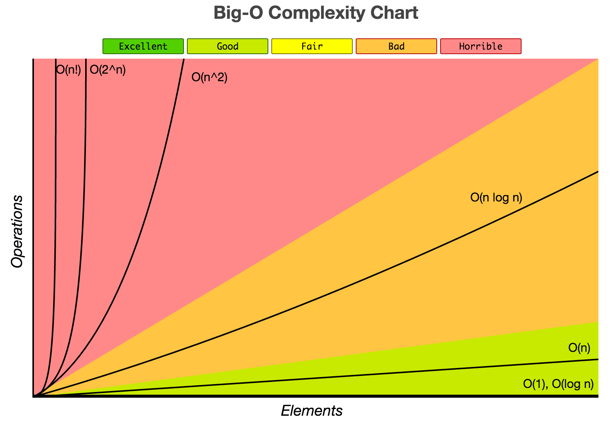
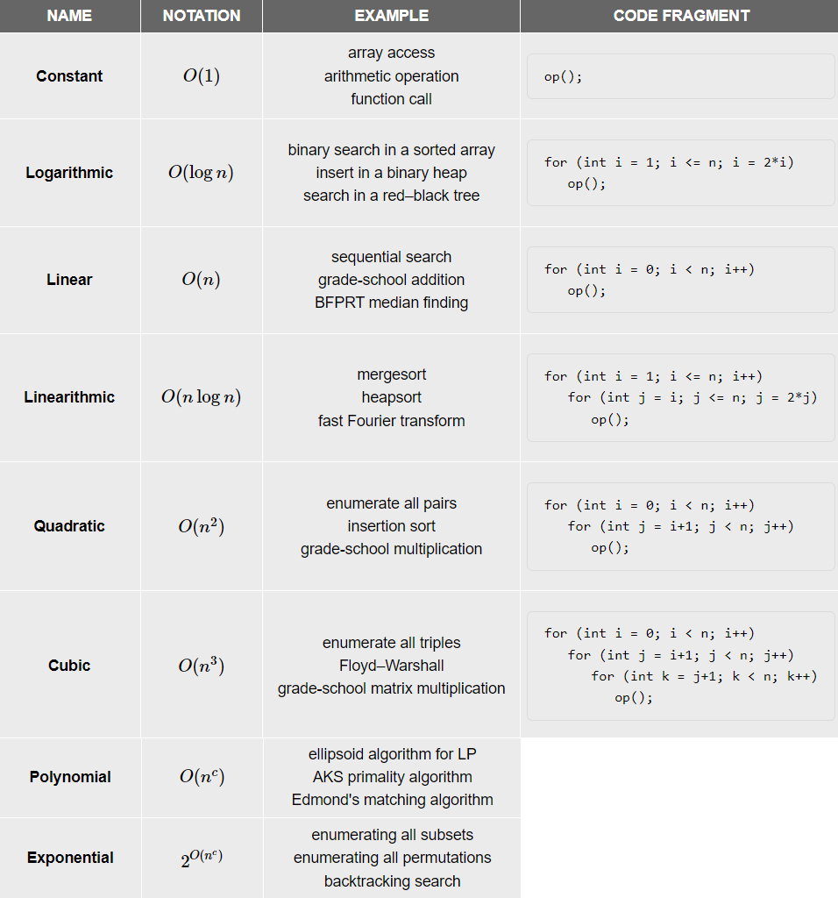
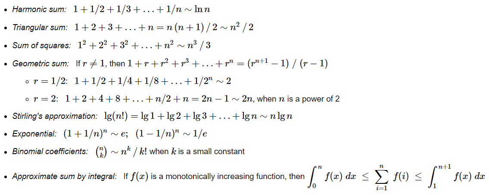
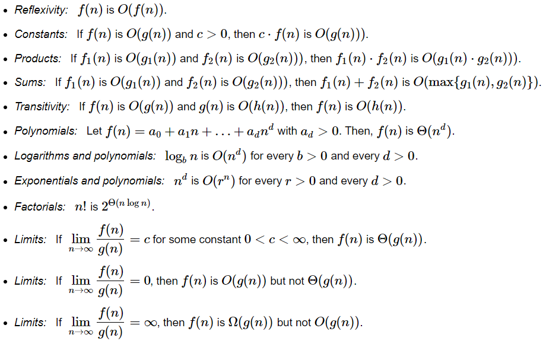
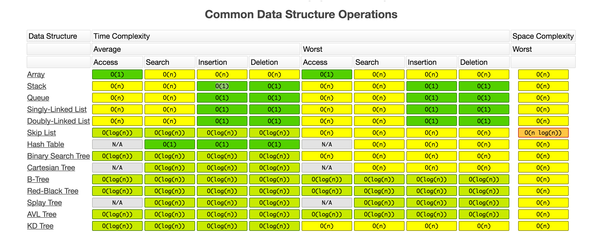
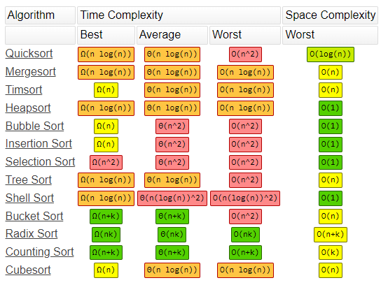
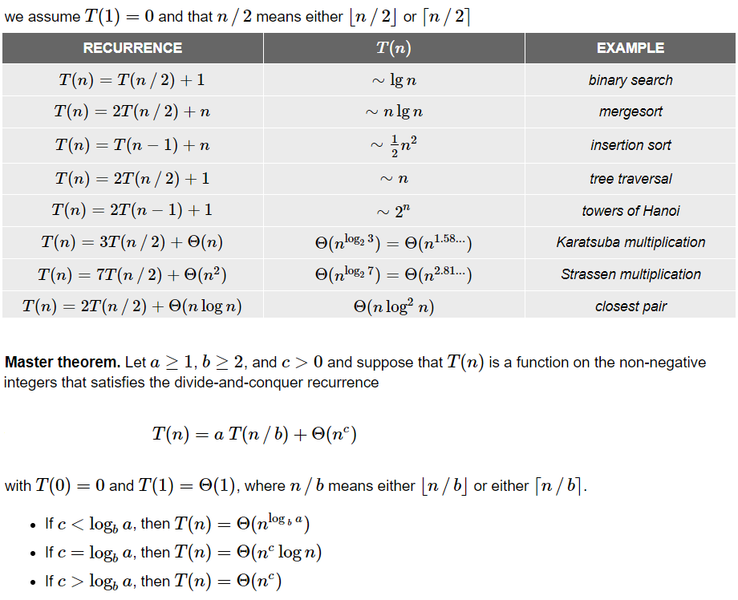

# Algorithms and Data Structures Cheatsheet

## Complexity chart
$f(n)$ is $O(g(n))$ means that $f(n)$ is bounded above by $g(n)$ asymptotically  
=> There exist constants $c>0$ and $n_0≥0$ such that $0≤f(n)≤c⋅g(n)$ for all $n≥n0$

  

## Useful formulas and properties 
Here are some useful formulas for approximations that are widely used in the analysis of algorithms.

 

## Data Structure Oprations

     
## Array Sorting Algorithms

## Divide-and-conquer recurrences

