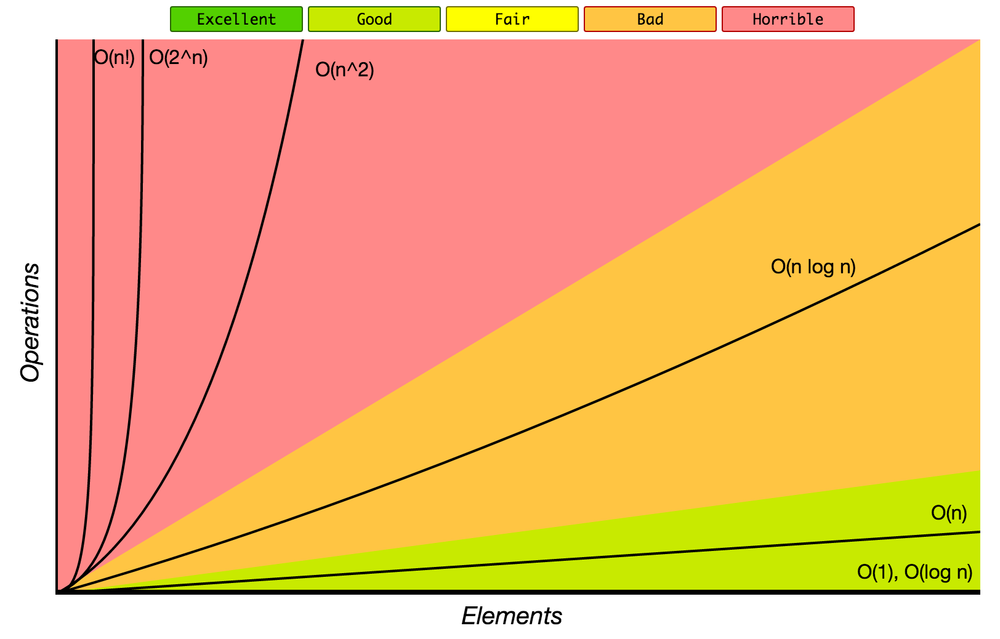
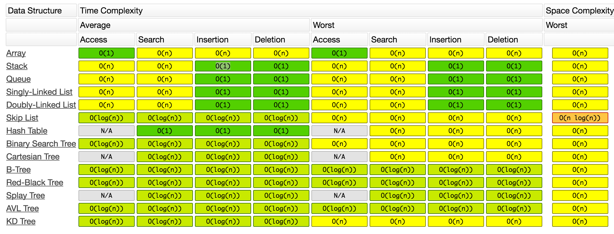

# Algorithms and Data Structures Cheatsheet

## Complexity chart
Big O time is used to describe the efficiency of an algorithm:
<ul>
  <li>Big O describes an upper bound on the time.</li>
  <li>Big Omega describes a lower bound on the time.</li>
  <li>Big theta means both O and Omega </li>
</ul>

  

## Useful formulas and properties 
Here are some useful formulas for approximations that are widely used in the analysis of algorithms.

 

## Data Structure Oprations

     
## Array Sorting Algorithms

## Divide-and-conquer recurrences

