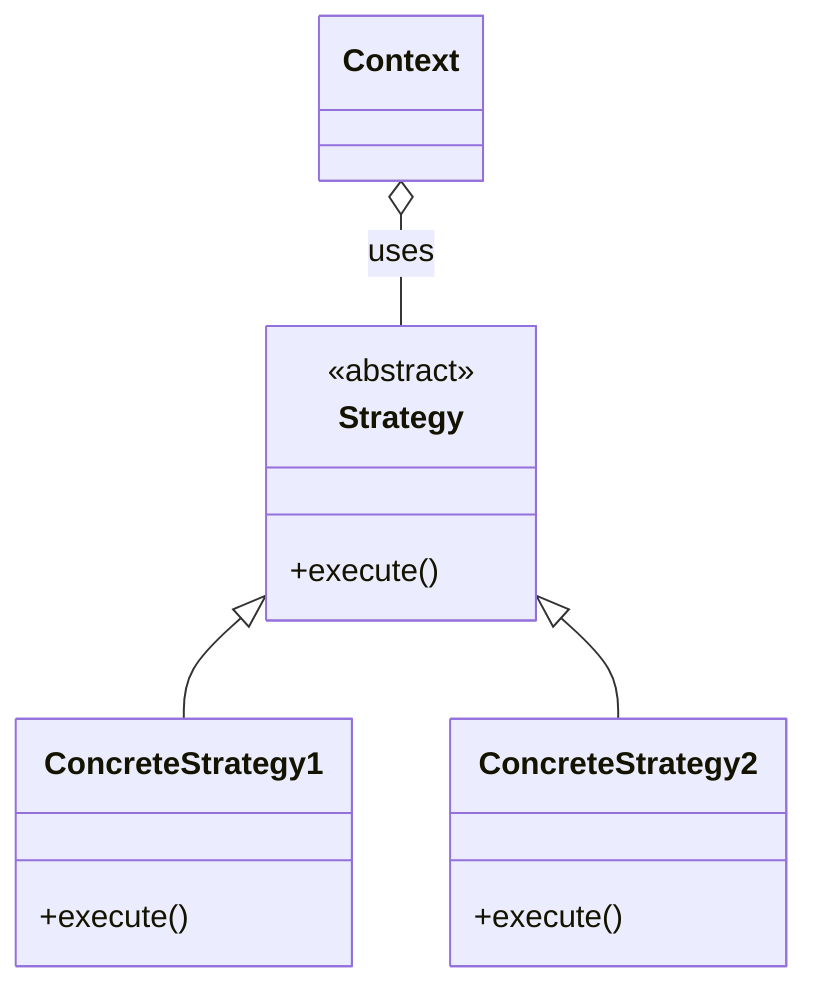

# VS code extensions

#### Live Share Whiteboard
Shared white board, nice for meetings.

#### Mermaid
Adds diagram and flowchart support to Markdown and Markdown cells in notebooks.

#### Better Comments
Categorise comments
- \* important information 
- ! deprecated method 
- ? should this be changed 
- TODO: refactor

#### autoDocstring
Generate automatically a docstring for the function. Type """ at the start of a new class/function to generate.